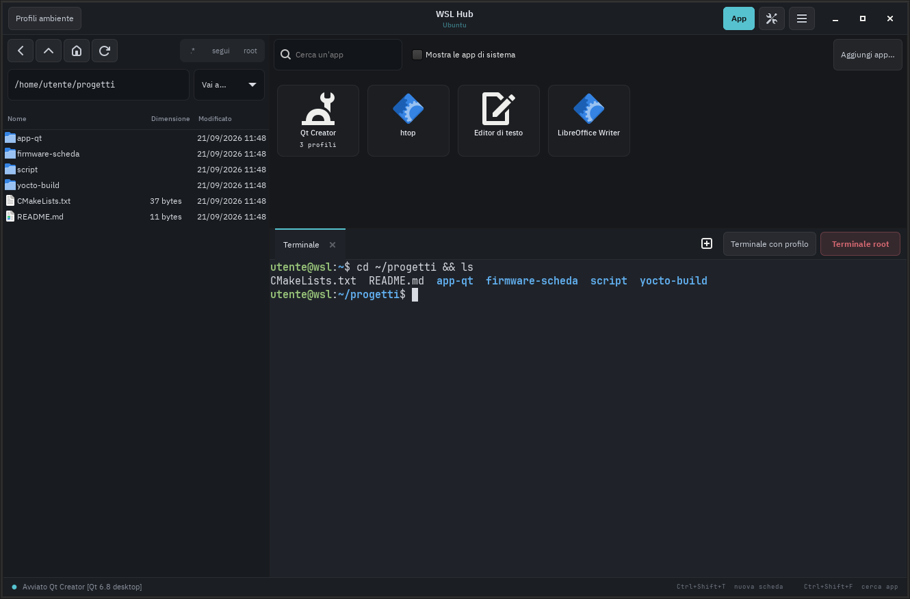

# WSL Hub

[English](README.md) | **Italiano**

Una finestra unica per lavorare in WSL: **terminale sempre presente**, **file manager** e **launcher di app**, con **profili d'ambiente** per avviare strumenti diversi con variabili diverse.

Il caso d'uso tipico è lo sviluppo per dispositivi embedded: con i profili passi in un clic da una versione all'altra del framework (ad esempio Qt) o da un SDK di cross-compilazione all'altro (ad esempio quelli generati con Yocto), per compilare e provare la stessa applicazione su dispositivi diversi.

Gira dentro WSL e viene mostrata su Windows tramite [WSLg](https://github.com/microsoft/wslg), come una normale applicazione con la sua icona nel menu Start.



## Funzioni

- **Terminale integrato** (VTE, lo stesso motore di GNOME Terminal) con schede. Chiudendo l'ultima scheda se ne apre subito un'altra, così il terminale c'è sempre.
- **File manager** con segnalibri, file nascosti, menu contestuale (rinomina, cestino, nuova cartella, copia percorso Linux o Windows) e sincronizzazione con la cartella del terminale.
- **Integrazione con Windows**: i file senza un'app Linux associata si aprono con il programma predefinito di Windows, e ogni cartella si può mostrare in Esplora file.
- **Launcher di app**: le app grafiche installate in WSL più le tue app personalizzate, con ricerca.
- **Profili d'ambiente**: gruppi di variabili (con riferimenti come `${PATH}`) e, se serve, uno script caricato con `source`. Si applicano alle app e ai terminali che avvii, senza toccare il resto del sistema. Se un'app ha più profili, al clic scegli con quale avviarla.
- **Accesso root**: terminale root, modalità root del file manager (lettura e modifica di `/root`, `/etc`, …) e «Modifica come root» per i singoli file. L'interfaccia resta con il tuo utente: come root girano solo le operazioni richieste.
- **Log delle app**: l'output di ogni app avviata finisce in un log. Se un'app si chiude subito con un errore, l'hub mostra le ultime righe.
- **Interfaccia in italiano e in inglese**, selezionabile dalle Impostazioni.
- **Avvio automatico** opzionale all'apertura di WSL, e istanza singola: aprirlo di nuovo porta in primo piano la finestra esistente.

## Requisiti

- Windows 11, oppure Windows 10 con una versione di WSL che includa WSLg (WSL dal Microsoft Store).
- Una distribuzione WSL 2 basata su Debian o Ubuntu (testato su Ubuntu 24.04).

Le dipendenze Linux (GTK 3, VTE, icone, font) vengono installate da `install.sh`.

## Installazione

Dentro WSL, come utente normale (**senza** `sudo`: lo script chiede la password quando serve):

```bash
git clone https://github.com/<utente>/wsl-hub.git
cd wsl-hub
./install.sh
```

Poi, da PowerShell, esegui `wsl --shutdown` e riapri la distribuzione: WSLg aggiunge **WSL Hub** al menu Start di Windows, e da lì puoi fissarlo sulla barra delle applicazioni.

Se l'icona non compare, `install.sh` stampa la riga per creare a mano un collegamento con `wslg.exe`.

### Avvio automatico all'apertura di WSL

```bash
./autostart.sh             # apre l'hub quando apri WSL, la console resta aperta
./autostart.sh --only-hub  # apre l'hub e chiude la console
./autostart.sh --remove    # disattiva
```

Lo script aggiunge un blocco delimitato a `~/.bashrc` e ne salva prima una copia. Il blocco non si attiva nei terminali dell'hub né in quello di VS Code.

## Profili d'ambiente

Un profilo è un insieme di variabili applicate **solo** al processo che avvii. Si gestiscono dal pulsante **Profili ambiente**.

- Le variabili sono applicate in ordine, e `${NOME}` si riferisce al valore già presente, comprese le variabili definite nelle righe precedenti:
  ```
  QTDIR            = ~/Qt/6.8.0/gcc_64
  PATH             = ${QTDIR}/bin:${PATH}
  CMAKE_PREFIX_PATH = ${QTDIR}
  ```
- Il campo **Script (source)** carica uno script prima dell'avvio. È utile con gli SDK che forniscono un file `environment-setup-*`, come quelli di Yocto.
- **Verifica valori** mostra i valori risultanti e segnala i percorsi che non esistono.
- Il pulsante **Terminale con profilo** apre una shell con quelle variabili. La variabile `WSL_HUB_PROFILE` contiene il nome del profilo attivo, per mostrarlo nel prompt:
  ```bash
  [ -n "$WSL_HUB_PROFILE" ] && PS1="[$WSL_HUB_PROFILE] $PS1"
  ```

Esempi completi (due versioni di Qt, un SDK Yocto, un'app da terminale) sono in [`config.example.json`](config.example.json).

WSL Hub non include e non distribuisce Qt né altri SDK: i profili si limitano a indicare dove si trova un'installazione già presente sul tuo sistema. Funziona allo stesso modo con qualunque edizione di Qt (open source o commerciale), e ciascuno resta responsabile della licenza del software che installa e usa.

## Accesso root

Il comportamento si sceglie nelle **Impostazioni** (icona a ingranaggio), oppure con `root_method` in `config.json`:

| Valore | Come si ottiene root |
|---|---|
| `"auto"` (predefinito) | `wsl.exe -u root`, senza password, lo stesso meccanismo di `wsl -u root` da PowerShell. Se `wsl.exe` non è raggiungibile, usa `sudo`. |
| `"sudo"` | Sempre `sudo`: la password viene chiesta in una finestra (file manager) o nel terminale (terminale root). |

`"auto"` non aggiunge rischi rispetto a una normale installazione di WSL, dove l'account Windows può già diventare root con `wsl -u root`. Se preferisci che la password venga chiesta ogni volta, usa `"sudo"`.

## Impostazioni e lingua

L'icona a ingranaggio nella barra del titolo apre le **Impostazioni**, dove puoi scegliere:

- **Lingua**: italiano, inglese, oppure *Automatica*, che segue la lingua del sistema WSL (`LANG`) e in mancanza usa l'inglese. Il cambio di lingua richiede il riavvio di WSL Hub, che il dialogo propone di fare subito. Le schede del terminale aperte vengono chiuse, mentre le app avviate restano in esecuzione.
- **Font del terminale**: applicato subito a tutte le schede aperte. Vengono proposti solo font monospazio.
- **Accesso root**: vedi [Accesso root](#accesso-root).

## Configurazione

Il file è `~/.config/wsl-hub/config.json` e viene creato al primo avvio. Si può modificare dal menu **☰ → Modifica config.json nel terminale** e poi applicare con **Ricarica la configurazione**.

| Chiave | Descrizione |
|---|---|
| `language` | `"auto"`, `"en"` o `"it"`. |
| `profiles` | Profili d'ambiente: `description`, `script`, `vars`. |
| `apps` | App personalizzate: `name`, `command`, `icon` (nome di icona o percorso), `cwd`, `terminal` (per i programmi testuali), `profiles`. |
| `bookmarks` | Segnalibri del file manager (`name`, `path`). |
| `root_method` | `"auto"` o `"sudo"`, vedi sopra. |
| `terminal_font` | Font del terminale, es. `"JetBrains Mono 11"`. |
| `dark_theme`, `gtk_theme` | Tema scuro e tema GTK (`""` per usare quello di sistema). |
| `show_hidden`, `show_system_apps` | Stato iniziale dei relativi interruttori. |

I log delle app sono in `~/.cache/wsl-hub/logs/`.

## Scorciatoie

| Tasti | Azione |
|---|---|
| Ctrl+Shift+T | Nuova scheda terminale |
| Ctrl+Shift+W | Chiudi scheda |
| Ctrl+Shift+C / V | Copia / incolla nel terminale |
| Ctrl+Shift+A | Mostra o nascondi il pannello app |
| Ctrl+Shift+F | Cerca un'app |

## Risoluzione dei problemi

- **L'icona non compare nel menu Start**: esegui `wsl --shutdown` da PowerShell e riapri la distribuzione.
- **Finestra troppo piccola su schermi ad alta risoluzione**: aggiungi `export GDK_SCALE=2` a `~/.profile`.
- **Un'app Qt non parte («Could not load the Qt platform plugin "xcb"»)**: installa `libxcb-cursor0`. Per i dettagli avvia l'app da un terminale con `QT_DEBUG_PLUGINS=1`.
- **Un'app non si avvia**: controlla il suo log in `~/.cache/wsl-hub/logs/`.
- **Le variabili modificate non si vedono in un terminale già aperto**: è il comportamento normale di Linux. Apri una nuova scheda con il profilo.

## Disinstallazione

```bash
./uninstall.sh          # rimuove programma, icona e avvio automatico
./uninstall.sh --purge  # rimuove anche configurazione e log
```

## Limiti noti

- Lingue disponibili: italiano e inglese (vedi [Aggiungere una lingua](#aggiungere-una-lingua)).
- Pensato per distribuzioni Debian/Ubuntu: su altre distribuzioni vanno installate a mano le dipendenze equivalenti.
- La modalità root del file manager non usa il cestino: l'eliminazione è definitiva, previa conferma.

## Aggiungere una lingua

Tutti i testi dell'interfaccia sono scritti in inglese in `wsl_hub.py` e passano dalla funzione `_()`. Per aggiungere una lingua:

1. Aggiungi codice e nome a `LANGUAGES`, ad esempio `"de": "Deutsch"`.
2. Aggiungi a `TRANSLATIONS` un dizionario che associa ogni stringa inglese alla sua traduzione. Il dizionario italiano è l'elenco completo delle stringhe da tradurre. Lascia invariati i segnaposto come `{name}`.
3. Se la lingua ha regole per il plurale diverse dall'inglese («1 elemento» / «2 elementi»), estendi `ngettext()`.

Le stringhe mancanti restano in inglese, quindi anche una traduzione parziale funziona.

## Licenza

WSL Hub è distribuito con licenza [MIT](LICENSE).

## Marchi

Qt è un marchio registrato di The Qt Company Ltd. e delle sue controllate. Windows e WSL sono marchi di Microsoft Corporation. Yocto Project è un marchio di The Linux Foundation. Tutti gli altri nomi di prodotti e aziende appartengono ai rispettivi proprietari e sono citati solo per indicare la compatibilità.

WSL Hub è un progetto indipendente: non è affiliato, sponsorizzato né approvato da The Qt Company, da Microsoft o da The Linux Foundation.
