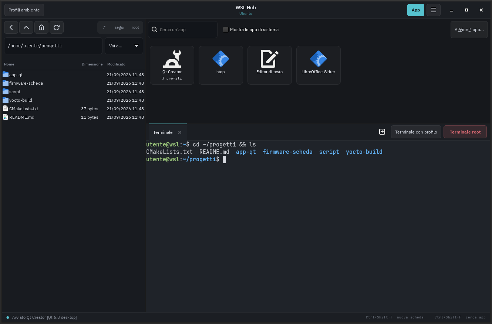

# WSL Hub

**English** | [Italiano](README.it.md)

A single window for working in WSL: an **always-on terminal**, a **file manager** and an **app launcher**, with **environment profiles** to start different tools with different variables.

The typical use case is embedded development: profiles let you switch in one click between versions of a framework (for example Qt) or between cross-compilation SDKs (for example those generated with Yocto), so you can build and test the same application for different devices.

It runs inside WSL and is displayed on Windows through [WSLg](https://github.com/microsoft/wslg), like a regular application with its own icon in the Start menu.

> **Note:** the user interface is currently in Italian. Button names in this README are quoted as they appear on screen, followed by an English translation.



## Features

- **Built-in terminal** (VTE, the same engine used by GNOME Terminal) with tabs. When you close the last tab, a new one opens right away, so the terminal is always there.
- **File manager** with bookmarks, hidden files, a context menu (rename, trash, new folder, copy the Linux or Windows path) and sync with the terminal's current folder.
- **Windows integration**: files with no associated Linux app open with the default Windows program, and any folder can be shown in File Explorer.
- **App launcher**: graphical apps installed in WSL plus your own custom apps, with search.
- **Environment profiles**: sets of variables (with references such as `${PATH}`) and, optionally, a script loaded with `source`. They apply only to the apps and terminals you start, without touching the rest of the system. If an app has several profiles, you pick one when you click it.
- **Root access**: a root terminal, a root mode for the file manager (read and edit `/root`, `/etc`, …) and "Edit as root" for single files. The interface keeps running as your user: only the operations you request run as root.
- **App logs**: the output of every app you start goes to a log. If an app exits right away with an error, the hub shows its last lines.
- **Optional autostart** when WSL opens, and a single instance: launching it again brings the existing window to the front.

## Requirements

- Windows 11, or Windows 10 with a WSL version that includes WSLg (WSL from the Microsoft Store).
- A WSL 2 distribution based on Debian or Ubuntu (tested on Ubuntu 24.04).

The Linux dependencies (GTK 3, VTE, icons, fonts) are installed by `install.sh`.

## Installation

Inside WSL, as a regular user (**without** `sudo`: the script asks for your password when needed):

```bash
git clone https://github.com/<user>/wsl-hub.git
cd wsl-hub
./install.sh
```

Then run `wsl --shutdown` from PowerShell and reopen the distribution: WSLg adds **WSL Hub** to the Windows Start menu, and from there you can pin it to the taskbar.

If the icon does not appear, `install.sh` prints the line to create a shortcut by hand with `wslg.exe`.

### Start automatically when WSL opens

```bash
./autostart.sh             # opens the hub when you open WSL, the console stays open
./autostart.sh --only-hub  # opens the hub and closes the console
./autostart.sh --remove    # turns autostart off
```

The script adds a delimited block to `~/.bashrc` and backs up the file first. The block does not run in the hub's own terminals or in the VS Code terminal.

## Environment profiles

A profile is a set of variables applied **only** to the process you start. Profiles are managed from the **Profili ambiente** (Environment profiles) button.

- Variables are applied in order, and `${NAME}` refers to the existing value, including variables defined in earlier rows:
  ```
  QTDIR             = ~/Qt/6.8.0/gcc_64
  PATH              = ${QTDIR}/bin:${PATH}
  CMAKE_PREFIX_PATH = ${QTDIR}
  ```
- The **Script (source)** field loads a script before launch. This is useful with SDKs that ship an `environment-setup-*` file, such as Yocto SDKs.
- **Verifica valori** (Check values) shows the resulting values and flags paths that do not exist.
- The **Terminale con profilo** (Terminal with profile) button opens a shell with those variables. The `WSL_HUB_PROFILE` variable holds the name of the active profile, so you can show it in your prompt:
  ```bash
  [ -n "$WSL_HUB_PROFILE" ] && PS1="[$WSL_HUB_PROFILE] $PS1"
  ```

Complete examples (two Qt versions, a Yocto SDK, a terminal app) are in [`config.example.json`](config.example.json).

WSL Hub does not include or distribute Qt or any other SDK: profiles only point to an installation that already exists on your system. It works the same way with any Qt edition (open source or commercial), and each user remains responsible for the license of the software they install and use.

## Root access

The behavior is set with `root_method` in `config.json`:

| Value | How root is obtained |
|---|---|
| `"auto"` (default) | `wsl.exe -u root`, with no password: the same mechanism as `wsl -u root` from PowerShell. If `wsl.exe` cannot be reached, `sudo` is used. |
| `"sudo"` | Always `sudo`: the password is asked in a dialog (file manager) or in the terminal (root terminal). |

`"auto"` adds no risk compared to a standard WSL installation, where the Windows account can already become root with `wsl -u root`. If you prefer to be asked for a password every time, use `"sudo"`.

## Configuration

The file is `~/.config/wsl-hub/config.json` and is created on first launch. You can edit it from the menu **☰ → Modifica config.json nel terminale** (Edit config.json in the terminal) and then apply it with **Ricarica la configurazione** (Reload configuration).

| Key | Description |
|---|---|
| `profiles` | Environment profiles: `description`, `script`, `vars`. |
| `apps` | Custom apps: `name`, `command`, `icon` (icon name or path), `cwd`, `terminal` (for text-mode programs), `profiles`. |
| `bookmarks` | File manager bookmarks (`name`, `path`). |
| `root_method` | `"auto"` or `"sudo"`, see above. |
| `terminal_font` | Terminal font, e.g. `"JetBrains Mono 11"`. |
| `dark_theme`, `gtk_theme` | Dark theme and GTK theme (`""` to use the system theme). |
| `show_hidden`, `show_system_apps` | Initial state of the matching toggles. |

App logs are in `~/.cache/wsl-hub/logs/`.

## Keyboard shortcuts

| Keys | Action |
|---|---|
| Ctrl+Shift+T | New terminal tab |
| Ctrl+Shift+W | Close tab |
| Ctrl+Shift+C / V | Copy / paste in the terminal |
| Ctrl+Shift+A | Show or hide the app panel |
| Ctrl+Shift+F | Search for an app |

## Troubleshooting

- **The icon does not appear in the Start menu**: run `wsl --shutdown` from PowerShell and reopen the distribution.
- **The window is too small on high-resolution screens**: add `export GDK_SCALE=2` to `~/.profile`.
- **A Qt app does not start ("Could not load the Qt platform plugin "xcb"")**: install `libxcb-cursor0`. For details, start the app from a terminal with `QT_DEBUG_PLUGINS=1`.
- **An app does not start**: check its log in `~/.cache/wsl-hub/logs/`.
- **Changed variables do not show up in a terminal that is already open**: this is normal Linux behavior. Open a new tab with the profile.

## Uninstall

```bash
./uninstall.sh          # removes the program, the icon and autostart
./uninstall.sh --purge  # also removes configuration and logs
```

## Known limitations

- The user interface is in Italian.
- Designed for Debian/Ubuntu distributions: on other distributions, install the equivalent dependencies by hand.
- The file manager's root mode does not use the trash: deletion is permanent, after confirmation.

## License

WSL Hub is released under the [MIT](LICENSE) license.

## Trademarks

Qt is a registered trademark of The Qt Company Ltd. and its subsidiaries. Windows and WSL are trademarks of Microsoft Corporation. Yocto Project is a trademark of The Linux Foundation. All other product and company names belong to their respective owners and are mentioned only to indicate compatibility.

WSL Hub is an independent project: it is not affiliated with, sponsored by or endorsed by The Qt Company, Microsoft or The Linux Foundation.
